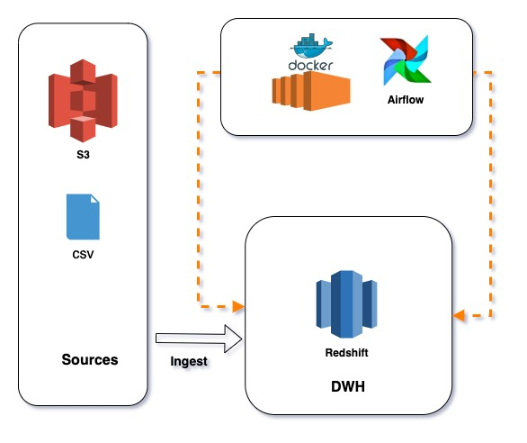
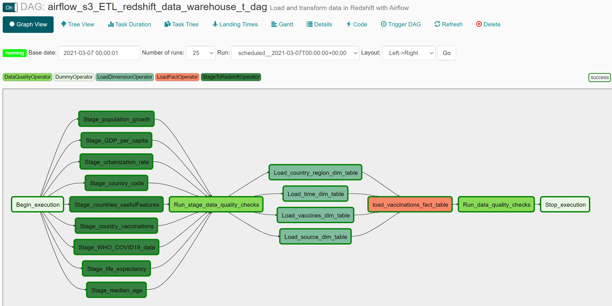
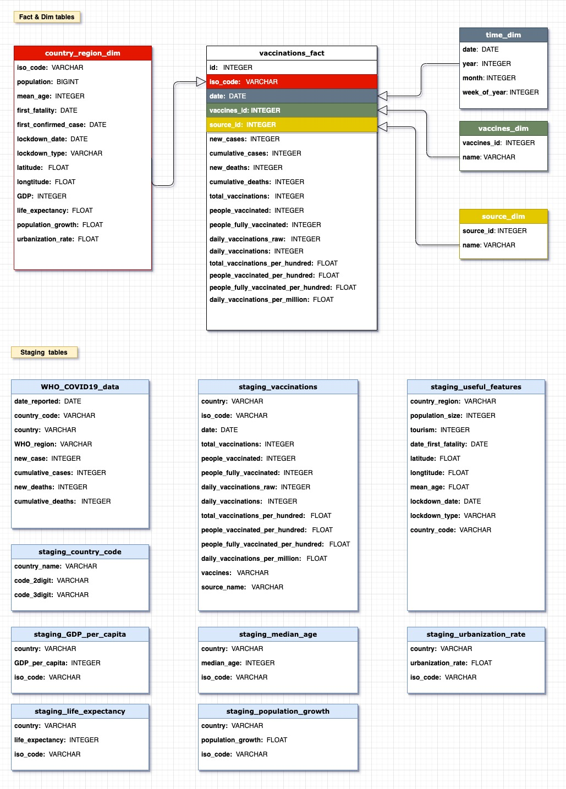

# DEND WHO COVID-19 Data Warehouse Redshift

The scope of project is to build a Data Mode to analysis CVID-19 world vaccination progress. For example We can analysis where need to speed up vaccination progress.

The following technologies were used:
- Spark
- Airflow
- AWS Redshift, S3

### Table of Contents

1. [Installation](#installation)
2. [Project Motivation](#motivation)
3. [File Descriptions](#files)
4. [Run](#results)
5. [Licensing, Authors, and Acknowledgements](#licensing)

## Installation <a name="installation"></a>

##### 1. Install Airflow Docker

 - Download docker and installing
https://www.docker.com/products/docker-desktop

##### 2. Installation docker-airflow 
```
docker pull puckel/docker-airflow

```
##### 3. Build docker-airflow
```
cd <project path>/docker-airflow/

docker build --rm --build-arg AIRFLOW_DEPS="datadog,dask" -t puckel/docker-airflow .

docker build --rm --build-arg PYTHON_DEPS="flask_oauthlib>=0.9" -t puckel/docker-airflow .
```

##### 4. Install project dependence
```
pip3 install pyspark
pip3 install pandas-redshift
pip3 install configparser

```

## Project Motivation<a name="motivation"></a>
The purpose of the data engineering capstone project is to give a chance to combine what learned throughout the program. 



##### Instructions

- Step 1: Scope the Project and Gather Data
- Step 2: Explore and Assess the Data
- Step 3: Define the Data Model
- Step 4: Run ETL to Model the Data
- Step 5: Complete Project Write Up




## File Descriptions <a name="files"></a>

```
- LICENSE
- README.md
- data   # raw data files
- image # project relevant images
- docker-airflow #  DAG files 
- research.ipynb # The project jupyter notebook file
```
## The Data sources:

The Daily and Total Vaccination for COVID-19 in the world is provided by Kaggle
- [country_vaccinations.csv](https://www.kaggle.com/gpreda/covid-world-vaccination-progress)

WHO Coronavirus Disease (COVID-19) is provided by WHO
- [WHO-COVID-19-global-data.csv](https://covid19.who.int/)

ISO country code provide by Kaggle
- [country_code.csv](https://www.kaggle.com/koki25ando/country-code)

The Data contains 12 columns provide by Kaggle
 - [ Countries_usefulFeatures.csv](https://www.kaggle.com/ishivinal/covid19-useful-features-by-country)
 
The Data extracted from Wikipedia's list of countries by category is provided by Kaggle 
 - [WORLD DATA by country (2020)](https://www.kaggle.com/daniboy370/world-data-by-country-2020?select=Life+expectancy.csv)

##### Fact table and Dimension table with star schemas


## Run <a name="results"></a>

##### Run Airflow Docker

```
docker-compose -f docker-compose-LocalExecutor.yml up -d

docker ps

docker exec -it <container_id> /bin/bash
```

## Licensing, Authors, and Acknowledgements <a name="licensing"></a>

### Built With
* [docker-airflow](https://github.com/puckel/docker-airflow) - Airflow Docker file
* [Pyspark](https://spark.apache.org/docs/latest/) - Pyspark API
* [Amazon Redshift](https://docs.aws.amazon.com/redshift/latest/dg/welcome.html) - AWS Redshift

### Versioning

* We use [SemVer](http://semver.org/) for versioning. For the versions available, see the [tags on this repository](https://github.com/your/project/tags).

### Authors

* **Tom Ge** - *Data egineer* - [github profile](https://github.com/tomgtqq)

### License

* This project is licensed under the MIT License

